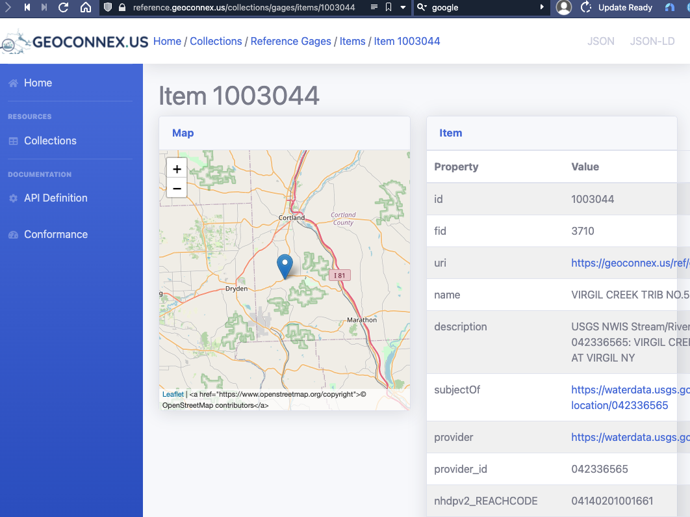
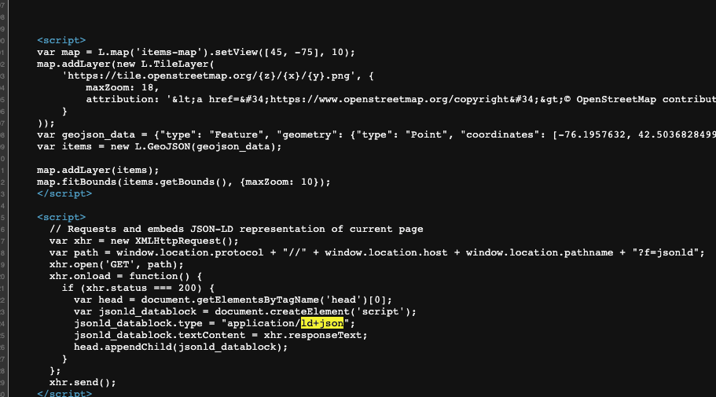

```{r setup, include=FALSE}
knitr::opts_chunk$set(echo = FALSE)
library(sf)
library(dplyr)
library(tidyr)
library(esri2sf)
library(readr)
d <- sf::read_sf("data/d1.geojson.json")
d2 <- sf::read_sf("data/d2.geojson.json")
d <- bind_rows(d,d2)
d$uri <- paste0("https://geoconnex.us/iow/gwtc2021-demo/",d$SourceID)

d <- dplyr::filter(d,!is.na(SourceID) & d$SourceID!="NA")
write_sf(d,"landing_pages/data/data.gpkg")
rm(d2)
library(mapview)

data <- sf::read_sf("data/6c78140c-b4f0-4283-ae18-651aa1f94fc6.gdb")
data$uri<-paste0("https://geoconnex.us/iow/gwtc2021-demo/",data$SourceID)
readr::write_csv(data,"data/data.geojson")
```
```{css, echo=FALSE}
pre {
  max-height: 300px;
  overflow-y: auto;
}

pre[class] {
  max-height: 400px;
}
```


```{css, echo=FALSE}
.scroll-100 {
  max-height: 400px;
  overflow-y: auto;
  background-color: inherit;
}
```

## Steps

1. Organize Data with NHD addresses (Reachcode/ measure), Establish persistent identifier scheme in data
1. Choose or format JSON-LD version
1. Publish feature-level landing pages with metadata on the web
1. Mint persistent identifiers at geoconnex.us for the features
1. Publish geojson at a publicly available RL
1. Register geojson with the NLDI repository


## Organize Data with NHD addresses (Reachcode/ measure), Establish persistent identifier scheme in data

Mike has shown how to use HydroAdd to add addresses and published them as feature service. Here, we download this data, and establish the identifier scheme:

https://geoconnex.us/iow/gwtc2021-demo/ + {NIDID}


```{r cars, results="asis", echo=TRUE, message=FALSE, warning=FALSE}
#d #downloaded and loaded into R
d$uri <- paste0("https://geoconnex.us/iow/gwtc2021-demo/",d$SourceID)
mapview(select(d,SourceID,uri,ReachCode,Measure),zcol=c("Measure"))
```

## Choose or format JSON-LD

In this dataset, we are dealing with a monitoring location which is being represented as a point location on a hydrologic network. A template for this kind of feature is available here: https://github.com/internetofwater/docs.geoconnex.us/wiki/hydrologic-location-template 

```{json, echo=TRUE, class_output="scroll-100"}
{
	"@context": [
		{
			"schema": "http://schema.org/",
			"skos": "https://www.w3.org/TR/skos-reference/",
			"hyf": "https://www.opengis.net/def/schema/hy_features/hyf/",
			"gsp": "http://www.opengeospatial.org/standards/geosparql/",
			"name": "schema:name",
			"sameAs": "schema:sameAs",
			"related": "skos:related",
			"description": "schema:description",
			"geo": "schema:geo",
			"image": {
				"@id": "schema:image",
				"@type": "@id"
			}
		}
	],
	"@id": "{{uri}}",
	"@type": [
		"https://www.opengis.net/def/schema/hy_features/hyf/HY_HydrometricFeature",
		"https://www.opengis.net/def/schema/hy_features/hyf/HY_HydroLocation"
	],
    "name": "{{name}}",
	"description": "{{description}}",
	"sameAs": "{{reference_uri}}",
	"hyf:referencedPosition": [
		{
			"hyf:HY_IndirectPosition": {
				"hyf:distanceExpression": {
					"hyf:HY_DistanceFromReferent": {
						"hyf:interpolative": "{{measure}}"
					}
				},
				"hyf:distanceDescription": {
					"hyf:HY_DistanceDescription": "{{upstream/downstream}}"
				},
				"hyf:linearElement": "{{flowpath_uri}}"
			}
		}
	],
	"hyf:HY_HydroLocationType": "hydrometricStation",
	"geo": {
		"@type": "schema:GeoCoordinates",
      "schema:latitude": "{{latitude}}",
		"schema:longitude": "{{longitude}}"
	},
	"gsp:hasGeometry": {
		"@type": "gsp:Geometry",
		"gsp:asWKT": "POINT ({{longitude}} {{latitude}})"
	}
}

```

## Publish Feature-Level Landing pages

The idea is, every feature shoud get it's own URL, where an HTML (human readable) metadata resource can be found about that feature:

```{r, out.width='60%', fig.align='center', fig.cap='...'}

```
## Publish Feature-Level Landing pages

The idea is, every feature shoud get it's own URL, where an HTML (human readable) metadata resource can be found about that feature that includes our json-ld in the html *script headers* so web crawlers can interpret the metadata.

```{r, out.width='60%', fig.align='center', fig.cap='...'}

```


## Publish Feature-Level Landing pages

Let's demonstrate using pygeoapi (free and open source!)

## Mint persistent identifiers

Let's demonstrate using GitHub

